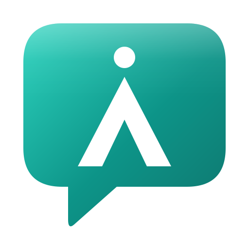

<div align="center">
  

  # آسامیت | Asameet

  **بستر هوشمند گفت‌وگو** — The Intelligent Conversation Platform

  پیام‌رسانی به روانی تلگرام + جلسات آنلاین به قدرت گوگل‌میت + دستیار هوش مصنوعی

  تهیه شده با ❤️ توسط ایرانی‌ها — گروه برنامه‌نویسی آ
</div>

---

## پنج خروجی محصول

| # | خروجی | مسیر / نحوه دسترسی |
|---|-------|---------------------|
| ۱ | **سایت معرفی محصول** | صفحه فرود در `/` (هیرو، ویژگی‌ها، تعرفه، FAQ، درباره ما، تماس) |
| ۲ | **محصول PWA** | همان دامنه — قابل نصب روی اندروید/iOS (`manifest.webmanifest` + Service Worker) |
| ۳ | **نسخه اندروید محصول** | `mobile/asameet` + گیت‌هاب اکشن `Build Android APKs` |
| ۴ | **پنل مدیریت** | تب «مدیریت» برای حساب مدیر — کنترل و نظارت، نمودار، خروجی اکسل |
| ۵ | **آساتاک — پیام‌رسان و تماس (شبیه تلگرام)** | `/talk` — گروه، کانال، پیام صوتی/ویدئویی، استیکر، تماس WebRTC، چند حساب، تنظیمات کامل — [docs/ASATALK.md](docs/ASATALK.md) |
| ۶ | **اپ اندروید آساتاک** | `mobile/asameet-messenger` — پوستهٔ Capacitor روی `/talk` |

## نسخهٔ زنده

- **محصول (Vercel):** https://asameet.vercel.app — با هر push روی `main` خودکار build و منتشر می‌شود
- **آساتاک:** https://asameet.vercel.app/talk

## حساب کاربری

ثبت‌نام واقعی با نام کاربری و رمز عبور از خود اپ انجام می‌شود (دکمهٔ «ثبت‌نام» در مودال ورود). رمزها با bcrypt هش می‌شوند، نشست‌ها در کوکی امن `httpOnly` نگه‌داری می‌شوند و داده‌ها در Postgres (Supabase) ماندگارند. **اولین حسابی که ساخته شود، مدیر بستر است** و تب «مدیریت» را می‌بیند.

## اجرای محلی

```bash
npm install
npm run dev          # http://localhost:3000
```

نکته: اپ به پایگاه‌دادهٔ ابری متصل است (پیکربندی در `src/lib/server/api.ts`)، پس اجرای محلی هم با داده‌های واقعی کار می‌کند.

## تکنولوژی

Next.js 16 (App Router) · TypeScript 5 strict · Tailwind CSS 4 · Framer Motion · Zustand · TanStack Query · Radix UI · Recharts · Postgres (Supabase، توابع SECURITY DEFINER) · PWA · Capacitor (Android) · Anthropic Claude (دستیار هوشمند)

## ساختار

```
src/app              # لایه‌بندی، صفحه اصلی (SPA تک‌مسیره)، globals.css، API routes
src/components       # landing / shared / messenger / calls / meetings / admin / ui
src/lib              # i18n (fa,en,fr,de,ar) · types · server/api (پل به دیتابیس) · utils
src/stores           # Zustand
supabase/migrations  # اسکیمای Postgres و توابع API (SECURITY DEFINER)
mobile               # دو اپ اندروید Capacitor
docs                 # پرامپت محصول، استقرار، اندروید، سیستم طراحی
```

## هوش مصنوعی

مسیر `/api/ai` سه حالت دارد: **صورت‌جلسه**، **خلاصه جلسه** و **هم‌فکری**. با تنظیم
`ANTHROPIC_API_KEY` از مدل Claude استفاده می‌شود؛ بدون کلید، خروجی دموی آماده برمی‌گردد
تا ارائه عمومی بدون هزینه هم کار کند.

## استقرار

- **Vercel:** بدون تنظیمات اضافه (`vercel.json` آماده است) — استقرار فعلی
- **سرور و دامنه نهایی:** `docker compose up -d` + نمونه کانفیگ `nginx.conf.example` — راهنمای کامل در [docs/DEPLOYMENT.md](docs/DEPLOYMENT.md)
- **اندروید:** راهنمای ساخت APK در [docs/ANDROID.md](docs/ANDROID.md)

مستندات بیشتر: [پرامپت محصول](docs/ASAMEET_PROMPT.md) · [سیستم طراحی](docs/DESIGN_SYSTEM.md) · [آساتاک](docs/ASATALK.md)
